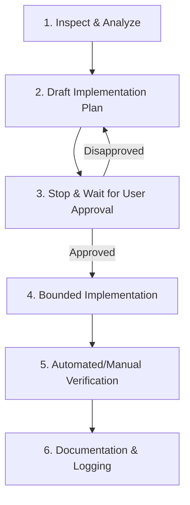

# Bookshop Management System — AI Governance & Handoff

This document details the software development life cycle (SDLC) safety rules, design protocols, and handoff procedures utilized by the AI coding assistant (Antigravity) during the development of this project.

---

## 1. AI Safety Governance Workflow
To prevent architectural regression, broken API endpoints, or database desynchronization, the development followed a strict **Inspect-Plan-Approve-Execute-Verify** sequence:

### Key Practices
* **No Unapproved Changes:** Implementation plans were written to the brain area and approved by the user prior to modifying files.
* **Minimal Intervention:** Solved bugs by patching target lines rather than rewriting entire services or tables.
* **Zero UI Regression:** Maintained styling rules (Bootstrap 5, Inter font token system) and responsive page layouts.

---

## 2. Workspace Commit Boundaries
* **No Auto-Push / Auto-Commit:** Antigravity is strictly barred from automatically committing or pushing codebase revisions to GitHub.
* **Manual Verification:** Developers run testing scripts locally (`verify-frontend.ps1`, linting) before making commits.
* **Explicit Branching:** Development took place on dedicated feature branches (e.g. `Yoosuf003`), allowing pull request validations.

---

## 3. Developer Handoff Instructions
For team members taking over the codebase:
1. **Starting the Application:** Follow the instructions inside [docs/runtime-startup-guide.md](file:///c:/Users/ASUS/workspace/Projects/Enterprise_Bookshop_Management_System/docs/runtime-startup-guide.md) to initialize ports 8001–8005 and 8081.
2. **Reviewing Code Map:** Check [docs/codebase-index.md](file:///c:/Users/ASUS/workspace/Projects/Enterprise_Bookshop_Management_System/docs/codebase-index.md) to understand dependencies.
3. **Database Schema:** Locate [database/sql/phase2_schema.sql](file:///c:/Users/ASUS/workspace/Projects/Enterprise_Bookshop_Management_System/database/sql/phase2_schema.sql) for database table schemas.
4. **Validating System Status:** Execute `verify-frontend.ps1` in PowerShell to run test validations.
