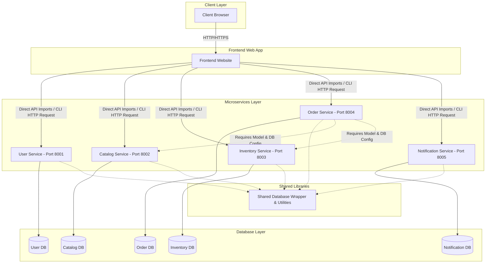

# Component Diagram Placeholder

This document is a placeholder for the Component Diagram of the Enterprise Bookshop Management System. The diagram represents the software components, their interfaces, and dependencies in a microservices architecture.

> [!NOTE]
> This diagram will be updated with assets generated from our modeling tool. Below is a Mermaid representation of the components for preview and design alignment.

## Microservices Component Preview

