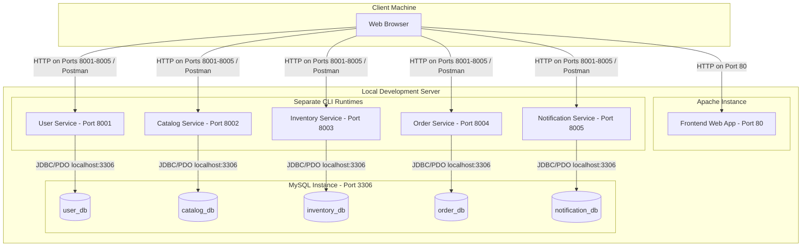

# Deployment Diagram Placeholder

This document is a placeholder for the Deployment Diagram of the Enterprise Bookshop Management System. The diagram shows the physical hardware nodes, network topologies, and execution environments onto which the system is deployed.

> [!NOTE]
> This diagram will be updated with assets generated from our modeling tool. Below is a Mermaid representation of our port-separated deployment architecture.

## Deployment Diagram Preview

