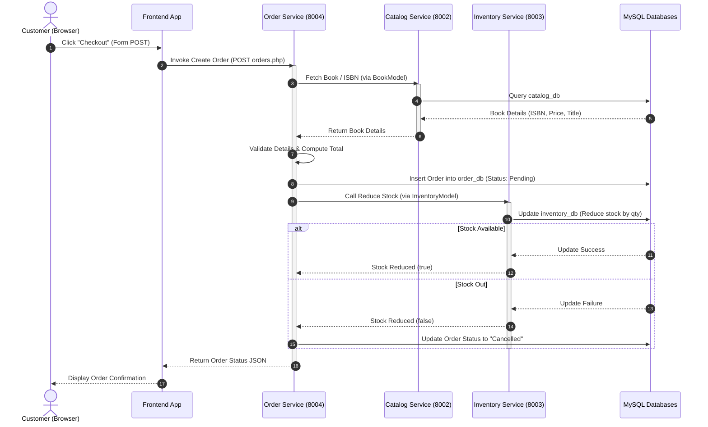

# Sequence Diagram Placeholder

This document is a placeholder for the Sequence Diagram of the Enterprise Bookshop Management System. The diagram traces the interaction and execution flow across components during a transaction, specifically during checkout/ordering.

> [!NOTE]
> This diagram will be updated with assets generated from our modeling tool. Below is a Mermaid representation of the checkout and stock reduction sequence for preview.

## Checkout Sequence Preview

